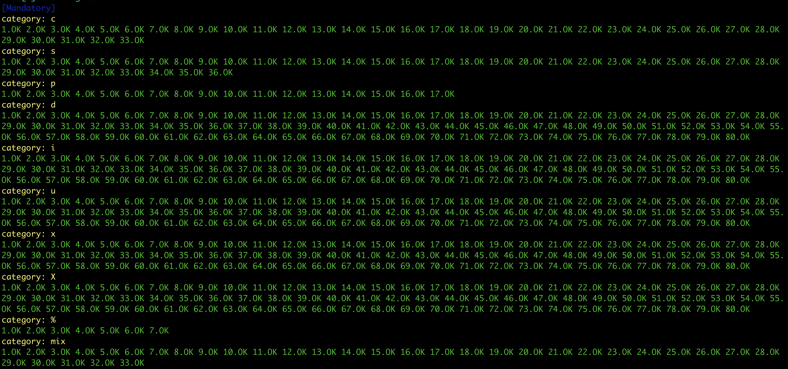
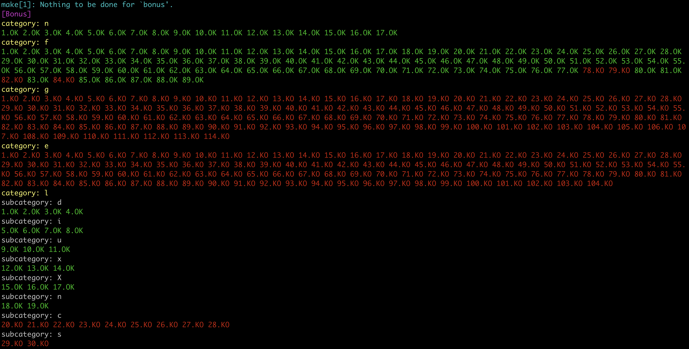
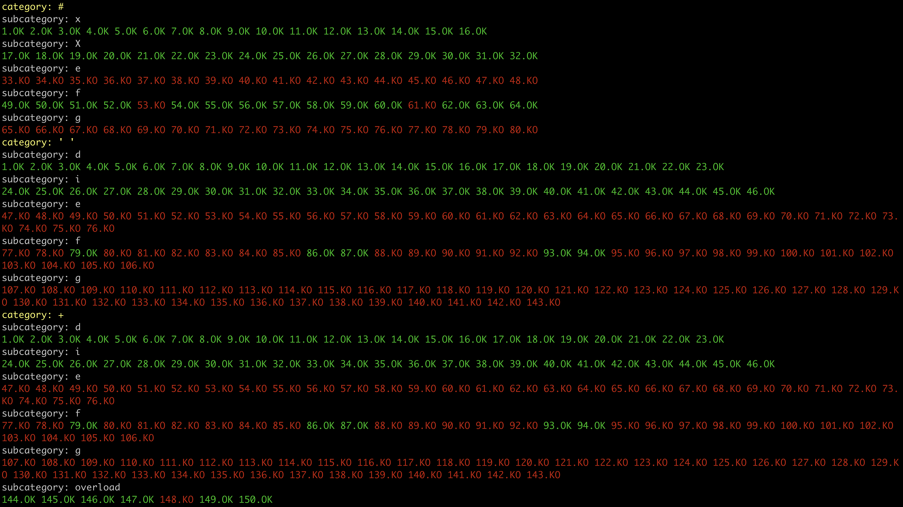

# ft_printf
42Cursus-ft_printf/42Lisboa

 
 
 
 

## PROGRESS
```
mandatory:
| case c: OK | case s: OK | case p: OK | case d: OK | case i: OK | case u: OK | case x: OK | case X: OK | case %: OK | 
bonus:
| case n: OK     | case f: KO | case e: KO | case g: KO |
| case space: OK | case +: OK | case #: KO |
| case l: KO     | case ll: OK | case h: OK | case hh: OK |
```
